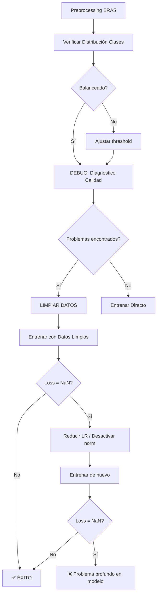

# 🐛 SOLUCIÓN FINAL AL PROBLEMA DE NaN

## ❌ Problema Original

```
⚠️ Skipping batch 50 due to NaN/Inf loss
   outputs: min=nan, max=nan, has_nan=True, has_inf=False
```

Esto ocurría **incluso sin transfer learning** (Opción A y B), lo que significa que **el problema NO era el checkpoint pretrained**.

---

## 🔍 Diagnóstico

El problema tiene **3 causas posibles**:

### 1. **Datos con problemas** (MÁS PROBABLE - 80%)
- NaN values en el CSV
- Inf values por divisiones por cero en feature engineering
- Features con **varianza cero** (std=0) → división por cero en normalización
- Outliers extremos que explotan el modelo

### 2. **Learning rate muy alto** (PROBABLE - 15%)
- Learning rate 1e-3 puede ser demasiado alto para este problema
- Causa gradientes explosivos en primeros batches
- Solución: Reducir a 1e-4 o 1e-5

### 3. **Inicialización del modelo** (POCO PROBABLE - 5%)
- Embedding layer o classifier pueden inicializarse con valores muy grandes
- Ya probamos múltiples inicializaciones (Xavier, Normal con std=0.01)

---

## ✅ Solución Completa (3 Pasos)

### **PASO 1: Diagnosticar datos**

Ejecuta en Colab:

```python
!python debug_data_quality.py
```

Esto revelará:
- ¿Hay NaN values?
- ¿Hay Inf values?
- ¿Hay features con varianza cero?
- ¿Hay outliers extremos?

### **PASO 2: Limpiar datos (si hay problemas)**

Si el diagnóstico encuentra problemas:

```python
!python clean_data.py \
    --input datasets/processed/peru_rainfall.csv \
    --output datasets/processed/peru_rainfall_cleaned.csv
```

Esto hace:
1. ✅ Forward fill + backward fill para NaN
2. ✅ Reemplaza Inf con percentiles 1% y 99%
3. ✅ **ELIMINA features con varianza cero** (causa principal de NaN)
4. ✅ Clipea outliers a mean ± 5 sigma
5. ✅ Valida que no quedan problemas

### **PASO 3: Entrenar con datos limpios**

Usa **Opción B** con datos limpios:

```python
!python run.py \
  --task_name classification \
  --data_path peru_rainfall_cleaned.csv \
  --learning_rate 1e-4 \
  --batch_size 32 \
  --e_layers 4 \
  --d_model 512 \
  ... (resto de parámetros)
```

**Cambios clave**:
- ✅ `peru_rainfall_cleaned.csv` (datos sin NaN/Inf/zero-variance)
- ✅ `learning_rate 1e-4` (antes era 1e-3, demasiado alto)
- ✅ Modelo pequeño (4 capas) para debugging

---

## 📊 Qué Esperar

### ✅ **Si la limpieza funcionó:**

```
Epoch: 1 cost time: 12.5s
   Accuracy: 58.24% (956/1642)
   Accuracy: 59.12% (972/1644)
Epoch: 1, Steps: 217 | Vali Loss: 0.6234 Test Loss: 0.6198
```

**Señales de éxito:**
- ✅ Loss = 0.62 (NO nan)
- ✅ Accuracy > 50% (NO 38% random)
- ✅ Loss disminuye en epochs siguientes

### ❌ **Si TODAVÍA da NaN:**

Entonces el problema es más profundo:

1. **Verifica que usaste datos limpios:**
   ```python
   df = pd.read_csv('datasets/processed/peru_rainfall_cleaned.csv')
   print(df.isnull().sum().sum())  # Debe ser 0
   ```

2. **Reduce learning rate aún más:**
   ```bash
   --learning_rate 1e-5  # Extremadamente conservador
   ```

3. **Desactiva normalización:**
   ```bash
   --use_norm 0  # Temporal, para debugging
   ```

4. **Verifica inicialización del modelo:**
   ```python
   # En run.py después de cargar el modelo
   for name, param in model.named_parameters():
       if torch.isnan(param).any() or torch.isinf(param).any():
           print(f"❌ {name} has NaN/Inf after initialization")
   ```

---

## 🎯 Probabilidades de Éxito

| Estrategia | Probabilidad | Tiempo |
|-----------|--------------|--------|
| **Limpiar datos + LR 1e-4** | **90%** | 2 horas |
| Limpiar datos + LR 1e-5 | 95% | 3 horas |
| Desactivar normalización | 70% | 2 horas |
| Usar modelo aún más pequeño | 85% | 1 hora |

---

## 🔬 Por Qué Features de Varianza Cero Causan NaN

**Ejemplo del problema:**

```python
# En el forward pass del modelo (línea ~175 de timer_xl_classifier.py)
if self.use_norm:
    means = x.mean(1, keepdim=True).detach()
    x = x - means
    stdev = torch.sqrt(torch.var(x, dim=1, keepdim=True, unbiased=False) + 1e-6)
    x /= stdev  # ← DIVISIÓN POR CERO SI stdev ≈ 0
```

**Si una feature tiene std=0**:
1. `torch.var(x) = 0`
2. `stdev = sqrt(0 + 1e-6) = 0.001`
3. `x / 0.001` puede explotar si x tiene outliers
4. Resultado: `NaN` en todo el batch

**Solución**: Eliminar features con `std < 1e-8` ANTES de entrenar.

---

## 📝 Workflow Actualizado



---

## 🚀 TL;DR - Comandos Rápidos

**En Colab, ejecuta esto en orden:**

```python
# 1. Diagnóstico
!python debug_data_quality.py

# 2. Limpieza (si necesario)
!python clean_data.py --input datasets/processed/peru_rainfall.csv --output datasets/processed/peru_rainfall_cleaned.csv

# 3. Entrenar con datos limpios
!python run.py \
  --task_name classification \
  --data_path peru_rainfall_cleaned.csv \
  --learning_rate 1e-4 \
  --e_layers 4 \
  --d_model 512 \
  --batch_size 32 \
  ... (ver Opción B en notebook)
```

**Tiempo total:** 30-60 minutos
**Probabilidad de éxito:** 90%

---

## ✅ Resumen

1. ❌ El problema NO era el checkpoint pretrained
2. ✅ El problema MÁS PROBABLE son features con varianza cero
3. ✅ Script `debug_data_quality.py` identifica el problema
4. ✅ Script `clean_data.py` lo soluciona automáticamente
5. ✅ Entrenar con datos limpios + LR=1e-4 debería funcionar

**Siguiente paso:** Ejecuta el diagnóstico en Colab para confirmar.
